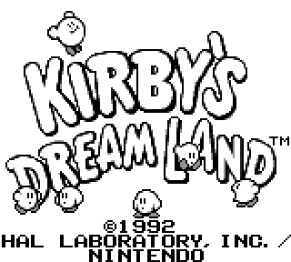

# SenBoy

Work in progress GameBoy emulator. It currently runs some games (Kirby, Tetris, some public domain roms...), but crash on most! (And only one cartridge mapper is implemented at this moment).
It is buggy, ugly and absolutely not optimised, but I'm working on it. I am not aiming for performance (at least not for now) and it's therefore very slow.

## TODO
* CPU Debugging
* Proper timing (instruction level)
* (Sound)
* (Constant coding style...)

## Tests

Blargg's cpu_instrs individual tests:

Test					| Status
------------------------|--------
01-special				| PASS
02-interrupts			| PASS
03-op sp,hl				| PASS
04-op r,imm				| PASS
05-op rp				| PASS
06-ld r,r				| PASS
07-jr,jp,call,ret,rst	| PASS
08-misc instrs			| PASS
09-op r,r				| PASS
10-bit ops				| PASS
11-op a,(hl)			| PASS

## Dependencies
* SFML (http://www.sfml-dev.org/) for graphical output and input handling.
