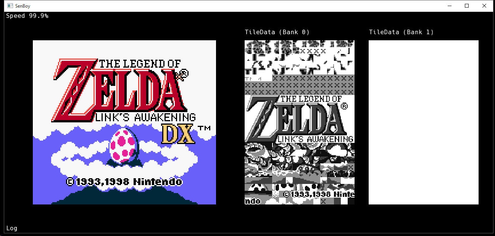
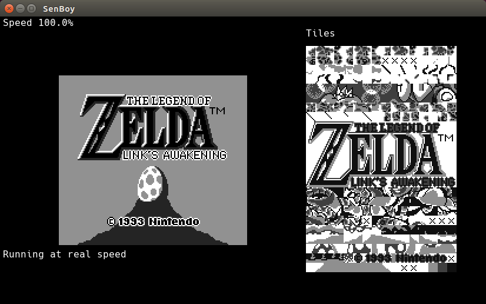
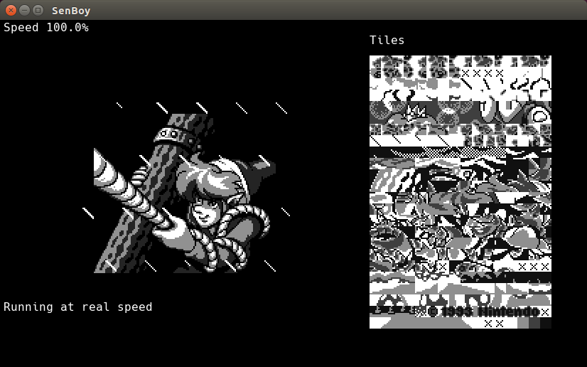
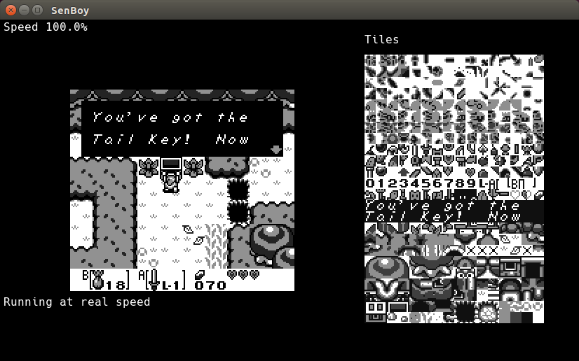

# SenBoy

Work in progress GameBoy (Color) emulator. All Original Gameboy games I tested were fully functional, expect maybe for some graphical glitches. 
Gameboy Color support however is still in early stages, Link's Awakening DX for example runs decently, but there is a lot more to do. 
It is buggy, ugly and absolutely not optimised. I am not aiming for performance anyway and it's therefore pretty slow. Also, it still lacks a proper GUI (Debugging infos all over the place).

## Screenshots

### Gameboy Color
 

 

### GameBoy

  

## Compilation

Compilation as only been tested on Ubuntu/Windows (MinGW) with g++.
You will need CMake and a copy of SFML 2.X (see Dependencies). On Windows, or if you used a non standard install path, you may want to set the CMake variables `CMAKE_PREFIX_PATH` to where are stored the SFML libraries and `SFML_INCLUDE_DIR` to the folder containing the SFML headers (using cmake-gui or the command line). Once this done, this should be enough:
````
cmake .
make
````
## Usage

Note: You will need GB (CGB) Bios in data/bios.bin (data/gbc_bios.bin) for SenBoy to run normally (You can skip bios by adding option -b in command line, but some things might break (Notably palettes of GameBoy games in GameBoy Color mode)).
**SenBoy still lacks a proper GUI**.
Pass a rom path via the command line to run it :
````
./SenBoy path/to/the/rom [options]
````

Option			| Effect
----------------|--------
-d				| Uses Debug Display (with tiles data)
-b				| Skip Boot ROM (May cause problems)

Controls uses any connected Joystick. There is no way to configure it ! (Values are hard coded to match a Xbox360/XboxOne controller)
When SenBoy is running, the following shortcuts are available:

Key						| Action
------------------------|--------
Backspace				| Reset
Enter					| Toggle Debugging (Halt Execution)
Space					| Advance one instruction (in debug)
L						| Advance one frame
M						| Toggle Real Speed
B						| Add a breakpoint (peek at you console)
N						| Clear all breakpoints
NumPad +				| Volume Up
NumPad -				| Volume Down

## TODO
* Gameboy Color Mode
  * Debugging (Crash in Pokemon Crystal?)
  * Fix Shuttering in CGB Mode
  * DMG Games in CGB mode (Correct compatibility mode; some sprites disappears)
* GPU debugging
  * Check sprite priority/transparency
  * Check window position
* (Other Mappers? What popular games uses other mappers than MBC1/3/5?)
* (Constant coding style...)

## Tests

Blargg's cpu_instrs individual tests:

Test					| Status
------------------------|--------
01-special				| :white_check_mark: PASS
02-interrupts			| :white_check_mark: PASS
03-op sp,hl				| :white_check_mark: PASS
04-op r,imm				| :white_check_mark: PASS
05-op rp				| :white_check_mark: PASS
06-ld r,r				| :white_check_mark: PASS
07-jr,jp,call,ret,rst	| :white_check_mark: PASS
08-misc instrs			| :white_check_mark: PASS
09-op r,r				| :white_check_mark: PASS
10-bit ops				| :white_check_mark: PASS
11-op a,(hl)			| :white_check_mark: PASS
instr_timing			| :white_check_mark: PASS
01-read_timing			| :x: FAIL
02-write_timing			| :x: FAIL
03-modify_timing		| :x: FAIL

SenBoy is NOT sub-instruction accurate.

## Dependencies
* SFML 2.X (http://www.sfml-dev.org/) for graphical output and input handling.
* Gb_Snd_Emu-0.1.4 (http://blargg.8bitalley.com/libs/audio.html#Game_Music_Emu) for sound emulation (Included).

## Thanks
* http://gbdev.gg8.se/ for their awesome wiki.
* Shay 'Blargg' Green for his tests roms, his Gb_Snd_Emu library and all his contributions to the emulation scene!
